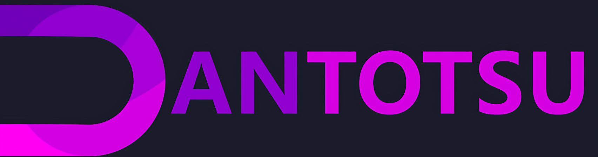
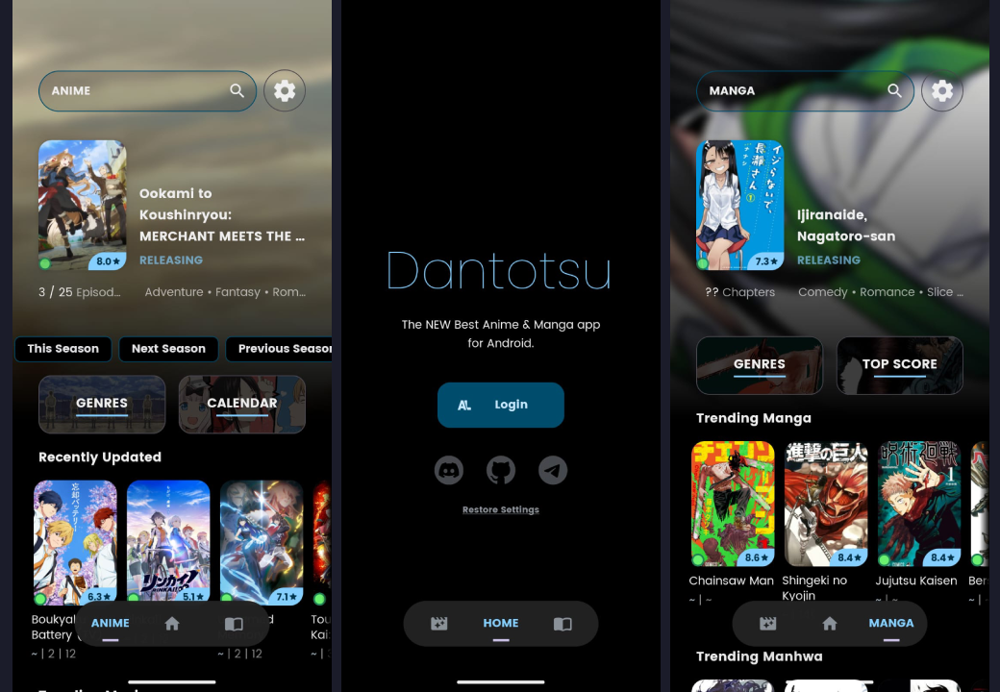

<h1 align="center">
A FOSS <a href="https://anilist.co/">AniList</a> Only Client
</h1>

Dantotsu (断トツ; Dan-totsu) "the best of the best". Try it out for yourself and be the judge!

   
   
   
   

*Read this document in other languages: [English](README.md), [Spanish](docs/README.es.md) (You can contribute to add more)*

## 📋 FEATURES 

- [x] Open Source
- [x] No Ads
- [x] AniList Sync
- [ ] Full AniList Client (WIP)
- [x] Themes
- [x] Extensions
- [x] Addons
- [x] Downloads
- [x] Offline Mode
- [x] Incognito Mode
- [x] Configurable Player
- [x] Configurable Reader
- [x] Notifications
- [x] Widgets
- [x] Discord RPC
- [x] Backup Settings
- [x] Comment Section

## 💾 INSTALLATION AND UPDATES 

1. Download Obtainium from the badge above
2. In the `Add App` screen, add the following URL as the App Source: https://github.com/rebelonion/Dantotsu/
3. Toggle `Verify the 'latest' tag` and `Reconcile string with version detected from OS`
4. To recive Beta updates, enable `Include prereleases`
5. Enjoy!

## 🚧 ALPHA BUILDS 

If you want to help test the app you can do it with one (1) of the following methods

> [!warning]
> ALPHA IS FOR TEST ONLY, YOU MAY ENCOUNTER BUGS. IF YOU DO, OPEN AN ISSUE IN OUR GITHUB REPOSITORY OR IN THE DISCORD CHANNEL.

1. Download the `Dantotsu-Split` file from [Github Actions](https://github.com/rebelonion/Dantotsu/actions), unzipit and install the APK
2. Join the [Telegram](https://t.me/+gzBCQExtLQo1YTNh) group and install the APK
3. Join the [Discord](https://discord.gg/4HPZ5nAWwM) group and choose the `Pre Tester` role, go to the `Pretest APK` channel and install the APK
4. Add the following URL as the App Source on Obtainium: https://github.com/kaorlol/dantotsu-updater

## 🤝 WANT TO CONTRIBUTE? 

All contributions are welcome: from code, documentation, graphics design, suggestions to bug reports. Please use GitHub to its fullest, whatever you have to offer, we can use it!

## ⭐ SUPPORT THE PROJECT 
If you like Dantotsu, you're welcome to star this repository to support the developers and encourage further development of the application, don't forget to take part in the official Discord community.

   

If you want to support Dantotsu's maintainer consider donating

## 👀 VISITORS 

## 📜 LICENSE 

Dantotsu is licensed under the [GNU General Public License v3.0](LICENSE.md)
