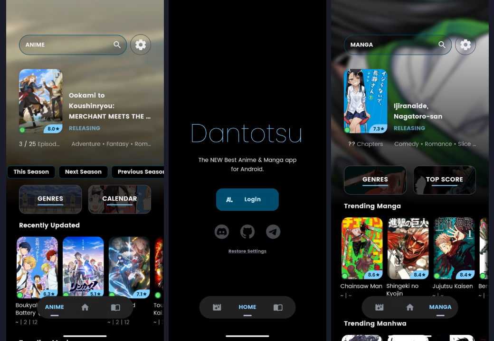

<h1 align="center">
Un Cliente de <a href="https://anilist.co/">AniList</a> FOSS
</h1>

Dantotsu (断トツ; Dan-totsu) "lo mejor de lo mejor". Pruebalo y juzga tu mismo!

   
   
   
   

*Lee este documento en otros idiomas: [Ingles](../README.md), [Español](docs/README.es.md) (Puedes contribuir para añadir mas)*

## 📋 CARACTERÍSTICAS 

- [x] Open Source
- [x] Sin Ads
- [x] Sincronización con AniList
- [ ] Cliente Completo de AniList (WIP)
- [x] Temas
- [x] Extensiones
- [x] Addons
- [x] Torrents
- [x] Descargas
- [x] Modo Offline
- [x] Modo Incognito
- [x] Reproductor Configurable
- [x] Lector Configurable
- [x] Notificaciones 
- [x] Widgets
- [x] Discord RPC
- [x] Backup de Ajustes
- [x] Sección de Comentarios

## 💾 INSTALACIÓN Y ACTUALIZACIONES 

1. Descarga Obtainium desde la insignia de arriba
2. En `Añadir Aplicación`, añade la siguiente URL como origen de aplicación: https://github.com/rebelonion/Dantotsu/
3. Activa `Comprobar la etiqueta 'latest'` y `Usar la versión detectada por el SO`
4. Para recivir actualizaciónes Beta, activa `Incluir versiones preliminares`
5. Disfruta!

## 🚧 VERSIONES ALFA

Si quieres ayudar a probar la app puedes hacerlo con uno (1) de los siguientes metodos

> [!warning]
> ALFA ES SOLO PARA PRUEBAS, PODRIAS ENCONTRAR BUGS. SI LO HACES, ABRE UN ISSUE EN NUESTRO REPOSITORIO DE GITHUB O EN EL CANAL DE DISCORD.

1. descarga el archivo `Dantotsu-Split` desde [Github Actions](https://github.com/rebelonion/Dantotsu/actions), descomprimelo e instala la APK
2. Entral al grupo de [Telegram](https://t.me/+gzBCQExtLQo1YTNh) e instala la APK
3. Entral al grupo de [Discord](https://discord.gg/4HPZ5nAWwM) elige el rol de `Pre Tester`, ve al canal `Pretest APK` e instala la APK
5. Añade la siguiente URL como origen de aplicación en Obtainium: https://github.com/kaorlol/dantotsu-updater

## 🤝 ¿QUIERES CONTRIBUIR? 

Todas las contribuciones son bienvenidas: desde código, documentación, diseño gráfico, sugerencias y hasta informes de errores. Por favor, usa GitHub al máximo, lo que sea que tengas para ofrecer, ¡podemos usarlo!

## ⭐ APOYA EL PROJECTO 
Si te gusta Dantotsu, puede añadir a favoritos este repositorio para apoyar a los desarrolladores y alentar un mayor desarrollo de la aplicación, no olvide participar en la comunidad oficial de Discord.

   

Si deseas apoyar al mantenedor de Dantotsu, considera donarle

## 👀 VISITANTES 

## 📜 LICENCIA 

Dantotsu esta licenciado bajo [GNU General Public License v3.0](LICENSE.md)
